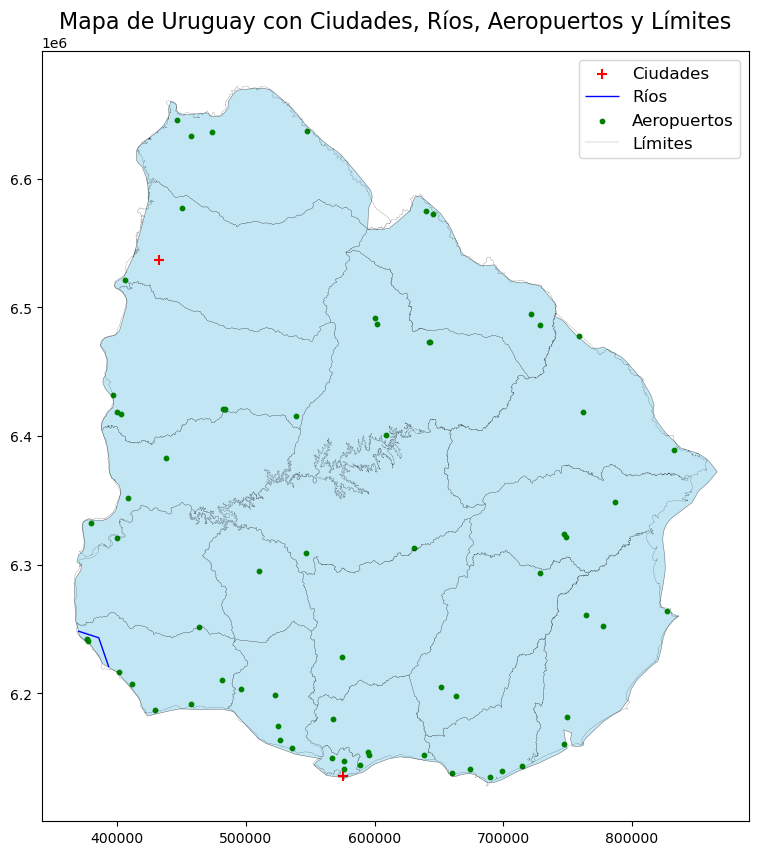
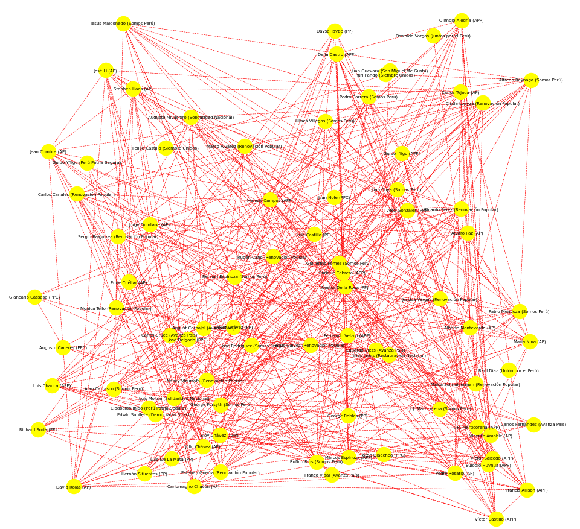
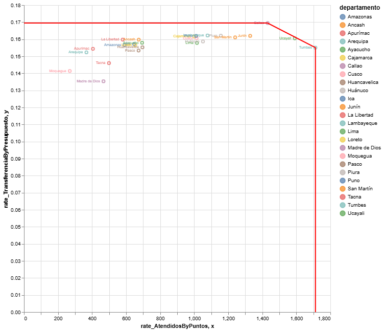
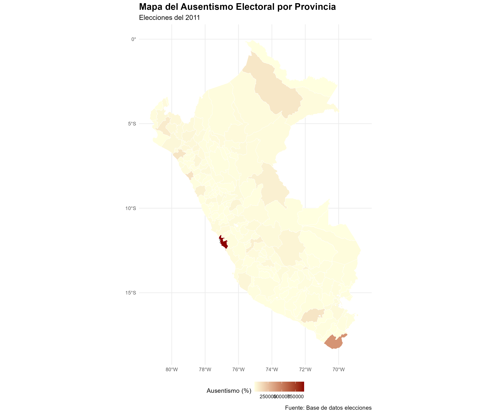

```{r setup, include=FALSE}
library(flexdashboard) # always
```

## Intro {.sidebar}

Se hizo una recopilación de los trabajos que más me gustaron con los temas del ciclo. No es algo muy llamativo pero si agrega todas las actividades que realizamos.


## Column {data-width="550"}

### Mapa de Uruguay

```{r}

```

### Grafico de redes de Alcaldes de Lima

```{r}

```

## Column {data-width="550"}

### Benchmarking de Pensión 65 por Departamento

```{r}

```

### Ausentismo

```{r}

```